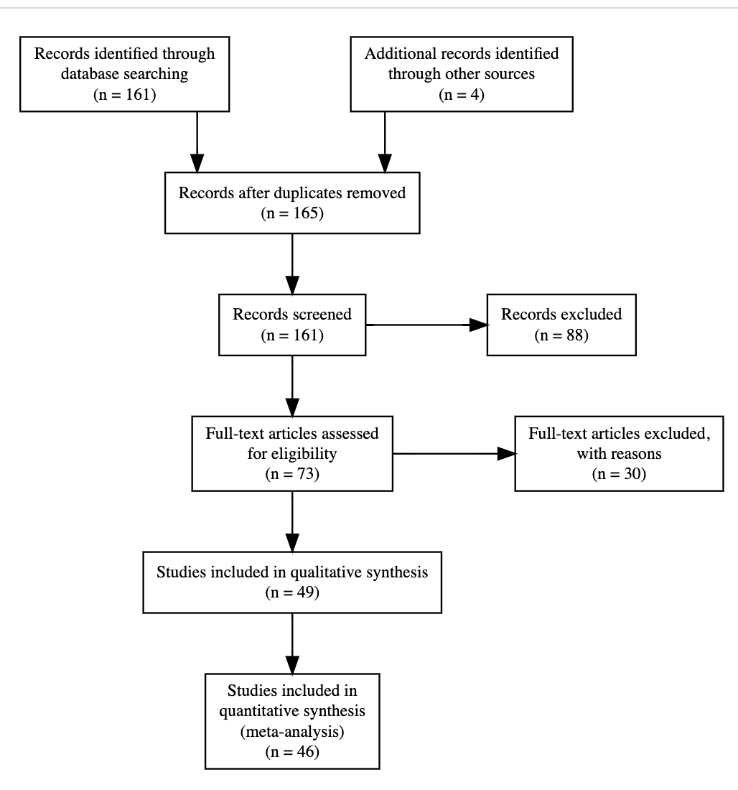

```{r global_options, include=FALSE}
knitr::opts_chunk$set(fig.crop = TRUE, 
                      fig.pos = "tb", fig.path='figs/',
                      echo=F, warning=F, cache=TRUE, 
                      message=F, sanitize = T)
```

```{r, libraries}
library(png)
library(grid)
library(ggplot2)
library(xtable)
library(tidyverse)
library(papaja)
library(knitr)
library(PRISMAstatement)
library(metafor)
library(here)
library(broom)
library(kableExtra)
```

# Introduction

Children learn word meanings quickly despite the large number of logically-possible hypotheses about the meaning of each individual word [@quine1954]. For example, when a child hears the word “spoon” in a scene which includes a spoon, plate, fork, food, and people, how would they know if the word “spoon” refers to the spoon object, its color, just the oval part of the object but not the rest, or this specific spoon but not other spoon-like objects? In response to this challenge, researchers have proposed a variety of innate constraints, learned biases, and reasoning processes that could potentially help children identify word meanings. One well-studied proposal is the *shape bias*: the tendency of children to generalize by the shape of objects more than other attributes like color, texture, or material when mapping a newly learned noun to a referent [@imai_childrens_1994; @landau1988]. 

One reason for researchers’ long-standing interest in the shape bias relates to its hypothesized role in early word learning, especially for nouns. In one study, @smith_object_2002 trained 17-month-old children over 7 weeks by repeatedly playing with and hearing names of unfamiliar objects from categories that were well organized by shape. Children who received the training showed evidence of generalizing new categories by shape compared with children who hadn’t received the training, suggesting that practice with shape categories had helped them acquire a broader, more general shape bias. Further, the trained group learned more object names -- as measured by parent reports -- during and after the intervention, suggesting that the shape bias could be an important tool for noun learning for children in this age group.

The shape bias is typically demonstrated in word extension tasks. For instance, in one study 15-month-old children were shown an exemplar object that had a specific non-visual property like producing a sound when tapped. Then children were asked which of the test objects – which matched the exemplar in either color, shape, or material – belonged to the same category. Children selectively extended the non-visual property to the test objects that resembled the exemplar in shape, revealing a bias towards this dimension [@graham_2010]. (Here we use the term “bias” as a convenient descriptor of this behavioral tendency without presupposing any particular underlying mechanism.)

Yet the degree of shape bias observed in word learning experiments varies across ages, cultures, languages, and experimental protocols and items. Some of this variation has been claimed to be theoretically important -- for example, cross-cultural and developmental variation -- while some is likely due to irrelevant procedural details, or random statistical variation. The current paper aims to synthesize evidence relating to the shape bias using statistical meta-analysis to quantify different sources of variation in the magnitude of the shape bias and to consider links between these sources of variation and potential theoretical accounts of the nature of the shape bias.

## Theoretical accounts of the shape bias

Where then does the shape bias come from? We consider four different explanations: innateness, learning from lexical statistics, learning from syntax, and learning from environmental statistics. These explanations are not necessarily mutually exclusive -- multiple sources of learning input could contribute to the developmental emergence of the shape bias. 

An initial explanation for the shape bias proposed that children have an innate tendency to generalize by shape. This proposal was called into question, however, by the observation that the shape bias is primarily found in linguistic generalization tasks as opposed to non-linguistic similarity judgment tasks [@landau1988; @smith_object_2002; @poulin1999role; @samuelson2000children] indicating that it is unlikely to be a generalized perceptual bias. Further, the magnitude of the shape bias appears to vary across ages, cultures, and languages, inconsistent with a purely nativist explanation.

An alternative proposal argues that children acquire the shape bias by generalizing the lexical statistics of their language. The early vocabulary of English-speaking children in the US is predominantly comprised of nouns referring to solid objects, suggesting that the shape bias may be an “over-hypothesis” that nouns tend to generalize in the same way as one another [@gershkoff2004shape; @samuelson_statistical_2002; @samuelson1999; @perry2010learn; @colunga2000learning; @yoshida2003known].  Children’s early experience with nouns referring to solid objects, in turn, privileges the property of shape, leading to an inductive bias, such that as children learn more nouns, they should be more likely to pick up on shape as an organizing regularity of the lexicon.

Additionally, this generalization may be guided by the syntax of their language. In English, count nouns (e.g., “ball”) are generalized by shape while mass nouns (e.g., “sand”) that cannot be modified by numerals or combined with indefinite articles (‘a’ or ‘an’) are not. The presence of this distinction might facilitate English-speaking children (and other children learning languages with a mass-count distinction) in picking out the category of words to which the shape bias can be productively applied. In contrast, children learning languages that lack the mass-count distinction (e.g., some East Asian languages like Mandarin or Japanese) do not have access to this organizing principle, making the statistics of their lexicon less clear cut. Some experiments have also explicitly varied whether count/mass language is used in the presentation of new objects, directly testing whether this syntactic cue guides generalization [@samuelson2008rigid; @soja1991ontological; @soja_perception_1992]. 

A final proposal is that children’s tendency to generalize by shape might in part be a function of their exposure to manufactured artifacts, since they often see many examples of an artifact that vary in color, size, or texture but are similar in shape (e.g., balls or toy cars). Exposure to such artifacts is higher in industrialized cultures where a built environment is more prevalent. While nearly all hammers are hammer-shaped, many plants are similar to one another in overall shape but vary in other details such as color, texture, or sub-part shape. Supporting this hypothesis, Tsimane’ speakers in Bolivia, who have relatively less artifact experience, showed a lower level of shape bias compared with English speakers from an industrialized culture (@jara2022).

## Dimensions of variation in the shape bias

Across the large literature investigating children’s shape-based generalizations, the magnitude of the observed shape bias varies widely. We next review some of these sources of variation, which guide the research questions that we assess using our meta-analysis. Some – but not all – sources of variation relate to the theoretical proposals about the origins of the shape bias. In addition, the links between observed variation and theory are not always clear and have rarely been stated in quantitative form. In the Discussion, we revisit the question of how to link our meta-analysis to theoretical accounts.

First, the shape bias varies developmentally. The shape bias appears to increase at or before the second birthday, continues to increase at the 3rd year until adulthood [@samuelson2008rigid; @landau1988] and perhaps decreases in some other studies of older children. For example, in one study, 3-year-olds showed a strong bias to generalize nouns by shape, while 5-year-olds and adults showed a weaker bias [@landau1998object]. In our meta-analysis, we attempt to quantify developmental change in the magnitude of the bias (Research Question 1).

Second, studies on the shape bias have been conducted across a variety of languages and cultures that vary in their mass/count syntax, other linguistic properties, and many cultural dimensions including industrialization. Speakers of Eastern Asian languages such as Japanese and Mandarin show a reduced tendency to rely on shape for word extension [@gathercole_1997; @imai1997; @jara2022; @samuelson1999; @soja1991ontological; @subrahmanyam_2006; @yoshida2003]. For instance, Japanese children showed a lower degree of shape bias than US children in one comparison [@imai1997]. The intersection of cross-linguistic and developmental variation adds another layer of complexity. In one study, English- and Mandarin-speaking 3-year-olds generalized by shape. In contrast, Mandarin-speaking 4-year-olds and adults generalized by material while English-speaking 4-year-olds and adults showed a preference for shape [@subrahmanyam_2006]. As is common in cross cultural/cross-linguistic research, observed variation across populations can be difficult to interpret due to the myriad correlated cultural and linguistic factors that differ between populations. We attempt to quantify evidence of cross-cultural differences across ages (Research Question 2).

Third, studies vary significantly in their procedures, stimuli, and comparison dimensions. For example, two-year-olds were found to generalize by shape in the case of artifacts, while relying on both shape and texture in the case of animate objects (@booth2005conceptual, @yoshida2003). On the other hand, when given information about objects’ function, preschool children reportedly used shape to generalize the noun label, while older children were more likely to use function (@graham1999; @gentner_1978; @smith_naming_1996; @landau1998object). Likewise, shape bias was found to be more prevalent with three dimensional objects than two dimensional ones (@davidson2018effects), and dissipated altogether when children were no longer forced to choose between test objects (@cimpian2005absence).
<!-- FIXME: no culture/language -->
Functionality and complexity are linked in the literature. English and Japanese-speaking children are found to prioritize shape for complex industry-based artifacts with clear functions. Only Japanese children, however, exhibit reduced shape generalization for simple uniform objects with no clear function (@imai1997; @gentner_1978). We also attempt to evaluate the relationship between complexity of objects and the propensity to generalize by shape (Research Question 3).

Finally, the syntax used in the presentation of stimuli varies across experiments. Some experimental procedures explicitly use mass/count marking to manipulate generalization , while other procedures avoid syntactic marking [@soja1991ontological; @imai1997; @samuelson2008rigid; @soja_perception_1992; @perry2011shape; @horst2013s; @dansereau2017young]. We attempt to quantify the effects of this marking and its interaction with development (Research Question 4). 

# The current study

Given the wide range of factors claimed to influence the shape bias, as well as the disparities between studies in their samples and methods, we were interested in consolidating the current base of knowledge. We therefore use statistical meta-analysis to estimate the overall effect size of the shape bias. In addition, we addressed the four research questions above by coding variation in age, language/culture, stimuli/procedure, and syntactic framing. We then conduct a series of meta-regressions, testing whether these covariates moderate the estimated shape bias effect.

We made the following pre-registered predictions about these covariates:

1. Shape bias increases with age, such that a greater shape bias is observed in older children.

2. There is a consistent association between population (with language as a proxy) and shape bias, such that the largest effect will be observed in English speaking populations, and the lowest in populations with the least industrialized environments. East Asian countries will lie in the middle. 

3. The strongest shape bias effect will be observed with simple uniform solid objects. 

4. Lastly, count and mass syntax will moderate the magnitude of the shape bias for younger children but not older children.

# Methods

```{r}
df_shape <- read_csv(here("data","shape_bias_meta.csv")) |>
  filter(!is.na(d))


df_shape$englishgrp <- fct_relevel(as.factor(df_shape$language %in% 
                                                 c("english")), 
                                     "TRUE")


df_shape$mean_age_months_centered36 <- df_shape$mean_age_months - 36
df_shape$log_mean_age_months <- log(df_shape$mean_age_months)

# df_shape$indoeuropean <- fct_relevel(as.factor(df_shape$language %in% 
#                                                  c("english","spanish", "german")), 
#                                      "IndoEuropean", "Non-Indoeuropean")

df_shape <- df_shape %>% mutate(indoeuropean = case_when(df_shape$language %in% 
                                                 c("english","spanish", "german") ~ "IndoEuropean", TRUE ~ "Non-Indoeuropean"))

df_shape <- df_shape |>
  filter(!is.na(d), !is.na(indoeuropean), !is.na(mean_age_months_centered36))

```
Except where noted, all hypotheses, literature search criteria, and statistical analyses were pre-registered at [linkretracted](). 

## Literature search

We created an initial set of papers based on google scholar searches using the key words "shape bias," "word generalization," "word learning," 
and citations of two papers [@landau1988; @imai1997]. Figure \@ref(fig:prisma) shows a PRISMA diagram describing our screening process.

```{r prisma, fig.height = 3.5, fig.width =3, out.width="100%", fig.cap="PRISMA diagram showing the results of our literature screening process."}


```

```{r prisma , eval= FALSE, fig.height = 3.5, fig.width= 3, out.width = "100%", fig.cap="PRISMA diagram showing the results of our literature screening process.", dev='png'}
#from https://cran.r-project.org/web/packages/PRISMAstatement/vignettes/PRISMA.html
prisma(found = 161,
       found_other = 4,
       no_dupes = 165, 
       screened = 161 , 
       screen_exclusions = 88, 
       full_text = 73,
       full_text_exclusions = 30, 
       qualitative = 49,
       quantitative = 46)

```
In total, 161 papers were found. We filtered these first via titles and abstracts and then via full-text screening, based on the following eligibility criteria:

Effects must be from an experiment (e.g., with random assignment of participants to at least two conditions), 

The paper must include participants less than 5 years old,

The paper must use a word extension task that contrasts shape with other properties of the referent. 

Applying these criteria resulted in `r length(unique(df_shape$ID))` papers that both satisfied our criteria and reported enough information to calculate the effect size (ES), either by directly reporting the ES reporting the proportion of choosing shape in text, tables or graphs; or reporting a statistical test (typically a comparison of shape bias against chance using a test such as  a one sample $t$-test). 

## Coding of effect size and moderators

The shape bias is typically measured via a range of word extension tasks. For example, in @landau1988, children were presented with a target novel object and told that it was a "dax" (a novel word), then presented with a series of test objects differing in shape, and asked about each, "Is this a dax?". The majority of studies used a forced choice task, where the child selected between test objects, or an endorsement task [like @landau1988], where the child judged whether a test object was in the category. 

Because many of the papers we coded were decades old, reporting standards varied considerably. Estimation of effect sizes was carried out via the following order of precedence: If the paper reported cohen’s d, we used it as the effect size in our MA (N=`r sum(df_shape$extraction == "reported")`). If the cohen’s d was not reported, we looked for test statistics to calculate the effect size. In the absence of this information, we used proportions reported in text and tables (N=`r sum(df_shape$extraction == "table")`) , or graphs (N=`r sum(df_shape$extraction == "graph")`) along with the standard deviation SD or the standard error SE. In the absence of reported SD or SE, we computed these via standard formulae.

For each effect size, we coded the following moderators: 

Participant age

Number of participants

Type of syntax used -- informative (count/mass) or neutral^[We additionally coded whether common or proper noun syntax was used and (if applicable) whether animate or inanimate syntax was used, but both of these were sparsely used and we do not discuss them further.]

The alternative stimulus properties for the test objects (e.g., shape, color, material)

The nature of the stimuli: solidity, animacy, and whether they were two- or three-dimensional

The type of exposure before testing: whether the child saw multiple training examples of the target object, or just a single example

Participants' vocabulary size

Country of test and language spoken by participants 

Response mode (grasping, pointing, or verbalizing) 

Measured behavior (e.g., behavioral, eye tracking) 

Population type (typically developing or not)

Total number of trials
```{r include=FALSE}
n_bilingual <- sum(df_shape$monolingual == "bilingual", na.rm=TRUE)
n_atypical <- sum(df_shape$child_type1 == "ASD", na.rm=TRUE)

df_shape <- filter(df_shape, 
                   monolingual == "monolingual", 
                   child_type1 == "TD")
```
We also coded a number of other moderators that were not part of our preregistered analyses and will not be described here. Because studies often included multiple age groups, different types of stimuli, and various manipulations, one experiment usually yielded more than one effect size, and often papers included multiple experiments. 
For our preregistered analyses, we excluded effect sizes from clinical populations (N=`r n_atypical`) and multilingual populations (N=`r n_bilingual`), though these effect sizes remain in the datafile we provide.
Representation across languages varied substantially, such that there were `r sum(df_shape$language == "english")` effect sizes for English while Japanese was the closest language with only `r sum(df_shape$language == "japanese")` data points. Other languages included German, Spanish, Chinese, Japanese, Korean, Vietnamese, and Tsimane. 
The final coded sample consisted of `r length(unique(df_shape$ID))` papers with `r nrow(df_shape)` effect sizes. 

## Analytic approach
All analyses were performed using the `metafor` package in R (Viechtbauer, 2010). We pooled effect sizes using a multi-level meta analysis model with experiment number nested within paper ID as a random effect, controlling for the non-independence of effect sizes from the same experiment or paper. We attempted to perform confirmatory analysis of our preregistered hypotheses via multi-level meta-regressions including age, language, item properties of the stimuli, and syntax as fixed effects. In some cases (described below), we did not have sufficient data to add particular factors to our analyses.

# Results
```{r main_model}
mod <- rma.mv(yi = d, 
              V = d_var, 
              random = ~ 1 | ID/exp_num,
              slab = short_cite, 
              data = filter(df_shape, !is.na(exp_num)))

df_forest <- tibble(short_cite = "Meta-analytic estimate", 
                    d = coef(mod), 
                    ci.lb = mod$ci.lb,
                    ci.ub = mod$ci.ub)

```

```{r heterogeneity}
#caluculating the heterogeneity from this website: https://www.metafor-project.org/doku.php/tips:i2_multilevel_multivariate 

W <- diag(1/mod$vi)
X <- model.matrix(mod)
P <- W - W %*% X %*% solve(t(X) %*% W %*% X) %*% t(X) %*% W
I2 <- sum(mod$sigma2) / (sum(mod$sigma2) + (mod$k-mod$p)/sum(diag(P)))
```

```{r forest, fig.height = 5, fig.width= 3 , echo=FALSE, fig.cap="Forest plot of all coded effect sizes, sorted by average effect size. Multiple points for an individual paper indicate multiple effects. Color indicates language family."}

df_shape %>% 
  mutate(short_cite = fct_reorder(short_cite, desc(d))) %>%
  ggplot(aes(x = short_cite, y = d, 
             ymin=d-sqrt(d_var)*1.96,
             ymax=d+sqrt(d_var)*1.96)) + 
  geom_pointrange(aes(color=indoeuropean), alpha = .5, position=position_dodge2(width=.5), size = 0.1) +
  geom_pointrange(data = df_forest, 
                  aes(ymin = ci.lb - 0.3, ymax = ci.ub + 0.3), pch = 5, col = "black", size = 0.2) + 
  coord_flip() +
  geom_hline(yintercept = 0, size = 0.2) +
  geom_hline(data = df_forest ,yintercept = df_forest$d , lty = 2 ) +
  aes(x=reorder(short_cite,-d, sum)) +  
  ylab("Standardized Mean Difference (d)") + 
  xlab("Citation") +
  ggthemes::scale_color_solarized(name = "Indo-European") +
  theme_minimal(base_size = 6) +
  # theme(legend.position = c(0.8, 0.5), legend.title=element_blank(), axis.title.y =element_blank(), 
  #       legend.background = element_rect(color = NA)) + 
  theme(legend.position = "bottom") +
  guides(color = guide_legend(override.aes = list(size = 0.1))) 

#c(0.1, 0.25)
```

```{r include=FALSE}
df_shape_solid <- df_shape %>% 
  filter(solid != "substance")
df_shape_summary <- df_shape %>%
  group_by(language) %>%
  summarize(count = n())

df_shape %>% group_by(complexity, ID) %>% filter( complexity == "complex") %>% summarize ( counts = n())
#length(which(df$column_name==value))

```
Figure \@ref(fig:forest) shows the overall forest plot for coded effect sizes. Our initial meta-analytic model with no moderators revealed an overall effect size of `r round(coef(mod), 2)` [`r round(mod$ci.lb, 2)`, `r round(mod$ci.ub,2)`] ($p$ `r papaja::apa_p(mod$pval)`), suggesting an overall shape bias effect across all studies. Nevertheless, effects varied substantially, yielding a substantial amount of between-study heterogeneity ($I^2 = `r round(I2, 2)`$). Not all stimuli in every study we coded were predicted by their authors to yield a shape bias. The number of effect sizes using solid objects in this MA is `r length(which(df_shape$solidity == 'solid')) ` while only `r length(which(df_shape$solidity != 'solid')) `  use non-solid objects. So, the heterogeneity remains high even when generalizing by shape for a set of stimuli that is dominated by solid objects, motivating our moderation effects. 

## Developmental change
Since the heterogeneity was very high, we subsequently incorporated age into our models to determine whether part of the heterogeneity could be explained by the developmental changes in the magnitude of the shape bias (RQ1). To determine the best functional curve that fits the development of shape bias, we followed our preregistered strategy of comparing four types of functional forms in our multi-level model: constant, linear, logarithmic, and quadratic. To compare models, we used the corrected Akaike information criterion AICc for model selection. A difference of more than four between the minimal AICc and any other AICc was interpreted as a meaningful difference. 

``` {r age_trend}
mod_intercept <- rma.mv(d ~ 1, 
                        V = d_var,
                        random = ~ 1 | ID/exp_num, 
                        slab = short_cite, 
                        data = filter(df_shape, !is.na(exp_num))) 

mod_age <- rma.mv(d ~ mean_age_months_centered36, 
                  V = d_var,
                  random = ~ 1 | ID/exp_num, 
                  slab = short_cite, 
                  data = filter(df_shape, !is.na(exp_num)))

mod_log_age <- rma.mv(d ~ log_mean_age_months, 
                      V = d_var,
                      random = ~ 1 | ID/exp_num, 
                      slab = short_cite, 
                      data = filter(df_shape, !is.na(exp_num))) 

mod_poly <- rma.mv(d ~ poly(mean_age_months_centered36,2), 
                   V = d_var,
                   random = ~ 1 | ID/exp_num, 
                   slab = short_cite, 
                   data = filter(df_shape, !is.na(exp_num), !is.na(mean_age_months_centered36)))

AICs <- tibble(aic = c(summary(mod_intercept)$fit.stats[5,'REML'],
                       summary(mod_age)$fit.stats[5,'REML'], 
                       summary(mod_log_age)$fit.stats[5,'REML'],
                       summary(mod_poly)$fit.stats[5,'REML']), 
               model = c("intercept", "age", "logage", "polyage")) |>
  mutate(delta_aic = aic - max(aic))
```

All models including age fit substantially better than the model without age ($\Delta_{AIC}$ between `r round(AICs$delta_aic[AICs$model == "logage"], 2)` and `r round(AICs$delta_aic[AICs$model == "polyage"], 2)`). The polynomial model fit best ($\Delta_{AIC} =$ `r round(AICs$delta_aic[AICs$model == "polyage"] - AICs$delta_aic[AICs$model == "age"], 2)`), so we adoptd a polynomial function for our following anaylsis.

```{r include = FALSE, dev_change, fig.pos="H", fig.cap = "Effect size plotted by average participant age. Points indicate individual effect, and error bars show variance. Points are colored based on language, and model fits for Indo-European and non-Indo-European languages are shown in black."}

mod_age_ie <- rma.mv(d ~ mean_age_months_centered36 * indoeuropean, 
                  V = d_var,
                  random = ~ 1 | ID/exp_num, 
                  slab = short_cite, 
                  data = filter(df_shape, !is.na(exp_num)))

df_pred <- expand_grid(mean_age_months_centered36 = 14:48,
                              indoeuropean = c(TRUE,FALSE)) |> 
          mutate(`mean_age_months_centered36:indoeuropean` =  
                   mean_age_months_centered36 * as.numeric(indoeuropean)) 

df_pred <- bind_cols(df_pred, as_tibble(predict(mod_age_ie, 
                                      newmods = as.matrix(df_pred)))) |>
  mutate(mean_age_months = mean_age_months_centered36 + 36, 
         indoeuropean = as.logical(1-indoeuropean)) # flip because coding for the predictor is IE = FALSE

# ggplot(df_shape,
#        aes(x = mean_age_months, y = d, color = language))+
#   geom_pointrange(aes(ymin = d - d_var, ymax = d + d_var), 
#                   alpha = .5, size = 0.3) + 
#   geom_line(data = df_pred, 
#               aes(y = pred, 
#                   group = indoeuropean, 
#                   lty  = indoeuropean), 
#               col = "black", size = 1) +
#   geom_ribbon(data = merged, 
#               aes(y = pred, 
#                   ymin = pred - se, 
#                   ymax = pred + se, 
#                   group = indoeuropean), 
#               fill = "black", alpha = 0.2) +
#   geom_hline(yintercept = 0, lty = 3) + 
#   ylab("Standardized Mean Difference (d)") + 
#   xlab("Mean age (months)") +
#   scale_color_discrete(name = "Language") +
#   scale_linetype_discrete(name = "Indo-European") +
#   theme(legend.position = "bottom") + 
#   theme_classic(base_size = 8)


```


```{r fig.width = 3.5, fig.height= 3, echo=FALSE, fig.cap = "Effect size plotted by average participant age. Points indicate individual effect, and error bars show variance. Points are colored based on language, and model fits for Indo-European and non-Indo-European languages are shown in black."}

mod_ployage_ie <- rma.mv(d ~ mean_age_months_centered36 * indoeuropean + I(mean_age_months_centered36^2) * indoeuropean, 
                         V = d_var,
                         random = ~ 1 | ID/exp_num, 
                         slab = short_cite, 
                         data = filter(df_shape, !is.na(exp_num)))

poly_predictions <- as.data.frame (predict(mod_ployage_ie))
poly_predictions$short_cite <- df_shape$short_cite
vector1 <- 1:293
poly_predictions$index <- vector1
df_shape$index <- vector1
merged <- merge(x = poly_predictions, y = df_shape[ , c("mean_age_months", "indoeuropean", "index")], by = "index")


# df_poly_pred <- expand_grid(mean_age_months_centered36 = -24:48,
#                             indoeuropean = c(TRUE,FALSE)) |> 
#   mutate('I(mean_age_months_centered36^2)' = I(mean_age_months_centered36^2),
#          `mean_age_months_centered36:indoeuropean` =  
#            mean_age_months_centered36 * as.numeric(indoeuropean),       `indoeuropean:I(mean_age_months_centered36^2)` = as.numeric(indoeuropean) * I(mean_age_months_centered36^2) ) 
# 
# df_poly_pred <- bind_cols(df_poly_pred, as_tibble(predict(mod_ployage_ie, 
#                                       newmods = as.matrix(df_poly_pred)))) |>
#   mutate(mean_age_months = mean_age_months_centered36 + 36, 
#          indoeuropean = as.logical(1-indoeuropean))


ggplot(df_shape,
       aes(x = mean_age_months, y = d, color = language))+
  geom_pointrange(aes(ymin = d - d_var, ymax = d + d_var),
                  alpha = .5, size = 0.1) +
  geom_line(data = merged, 
            aes(y = pred, 
                group = indoeuropean, 
                lty  = indoeuropean), 
            col = "black", size = 1) +
  geom_hline(yintercept = 0, lty = 3) + 
  ylab("Standardized Mean Difference (d)") + 
  xlab("Mean age (months)") +
  scale_color_discrete(name = "Language") +
  scale_linetype_discrete(name = "Indo-European") +  # Change the shape of the points in the legend
  theme_classic(base_size = 4) +
  theme(legend.position = "top", legend.title=element_blank(), legend.direction = "horizontal") +  # Adjust the size of the legend keys
  guides(color = guide_legend(override.aes = list(size = 0.00001))) + ggthemes::scale_color_solarized()


```


## Cross-linguistic differences
<!-- We will then fit moderators of interest in independent models (with interactions of age and moderator using the appropriate functional form found above): -->
<!-- Syntax - mass vs. count: bias ~ age * syntax -->
<!-- Language - English (and other european languages) vs. east asian language: -->
<!-- bias ~ language * age -->
<!-- Exemplar type (solid vs. non-solid): bias ~ exemplar type * age -->


<!-- * RQ2: There is a consistent association between population (with language as a proxy) and shape bias, such that the largest effect will be observed in English speaking populations, and the lowest in populations with the least industrialized environments. East Asian countries will lie in the middle.  -->

Based on the previous literature, we hypothesized that language and culture would be  potential moderators influencing the degree of shape-based generalization. Nevertheless, due to limited data availability beyond English, conducting language-specific analyses was not feasible. As a consequence, languages were categorized into two groups: Indo-European (encompassing German and Spanish and English), Non-Indo-European (including Japanese, Mandarin, Vietnamese, Korean, and Tsimane).
```{r include = FALSE, results = 'asis'}

#contrasts(df_shape$indoeuropean) <- contr.sum

lang_model <- rma.mv(d ~ mean_age_months_centered36 * indoeuropean + I(mean_age_months_centered36^2) * indoeuropean, 
                     V = d_var,
                     random = ~ 1 | ID/exp_num, 
                     slab = short_cite, 
                     data = filter(df_shape, !is.na(exp_num)))

mdlcoeff <- tibble(coeff = c(round(coef(lang_model),2)))

#mdlcoeff$coeff[1]


W_lang <- diag(1/lang_model$vi)
X_lang <- model.matrix(lang_model)
P <- W_lang - W_lang %*% X_lang %*% solve(t(X_lang) %*% W_lang %*% X_lang) %*% t(X_lang) %*% W_lang
I2_lang <- sum(lang_model$sigma2) / (sum(lang_model$sigma2) + (lang_model$k-lang_model$p)/sum(diag(P)))


lang_model_df <- as.data.frame(round(coef(summary(lang_model)), 4))

kableExtra::kbl(lang_model_df) %>%
  kable_classic_2(full_width = F)

writeLines(knitr::kable(lang_model_df,format = "latex", table.attr = "style='width:10%;'"))
```


<!-- \begin{tabular}{l|r|r|r|r|r|r} -->
<!-- \hline -->
<!--   & estimate & se & zval & pval & ci.lb & ci.ub\\ -->
<!-- \hline -->
<!-- Indo-european & 0.7560 & 0.0875 & 8.6367 & 0.0000 & 0.5844 & 0.9275\\ -->
<!-- \hline -->
<!-- Age & 0.0099 & 0.0034 & 2.8838 & 0.0039 & 0.0032 & 0.0166\\ -->
<!-- \hline -->
<!-- Non-indoeuropean & -0.0804 & 0.0807 & -0.9970 & 0.3188 & -0.2385 & 0.0777\\ -->
<!-- \hline -->
<!-- I(age,2) Indoeuropean & -0.0006 & 0.0001 & -5.2006 & 0.0000 & -0.0009 & -0.0004\\ -->
<!-- \hline -->
<!-- Age:non-indoeuropean & -0.0123 & 0.0075 & -1.6392 & 0.1012 & -0.0270 & 0.0024\\ -->
<!-- \hline -->
<!-- Non-indoeuropean:I(age,2) & -0.0003 & 0.0004 & -0.9706 & 0.3317 & -0.0011 & 0.0004\\ -->
<!-- \hline -->
<!-- \end{tabular} -->
\begin{table}[h]
\centering
\resizebox{0.5\textwidth}{!}{%
\begin{tabular}{l|r|r|r|r|r|r}
\hline
  & estimate & se & zval & pval & ci.lb & ci.ub\\
\hline
Indo-european & 0.7560 & 0.0875 & 8.6367 & 0.0000 & 0.5844 & 0.9275\\
\hline
Age & 0.0099 & 0.0034 & 2.8838 & 0.0039 & 0.0032 & 0.0166\\
\hline
Non-indoeuropean & -0.0804 & 0.0807 & -0.9970 & 0.3188 & -0.2385 & 0.0777\\
\hline
I(age,2) Indoeuropean & -0.0006 & 0.0001 & -5.2006 & 0.0000 & -0.0009 & -0.0004\\
\hline
Age:non-indoeuropean & -0.0123 & 0.0075 & -1.6392 & 0.1012 & -0.0270 & 0.0024\\
\hline
Non-indoeuropean:I(age,2) & -0.0003 & 0.0004 & -0.9706 & 0.3317 & -0.0011 & 0.0004\\
\hline
\end{tabular}%
}
\caption{Results of the meta-regression model incoroprating both language and age}
\end{table}


A model incorporating language group and age as moderators revealed a significant positive effect size of `r round(mdlcoeff$coeff[1], 2)` ($p=$ `r papaja::apa_p(lang_model$pval)[1]`) for Indo-European speakers at the age of 36 months of age but the effect decreases significantly with quadratic age `r round(mdlcoeff$coeff[1], 2)` ($p=$ `r papaja::apa_p(lang_model$pval)[1]`). However, we didn't find significant mean difference of effects for the non indo-european group. The between-study heterogeneity remained high (in fact with a slight increase) of ($I^2 = `r round(I2_lang, 2)`$).

``` {r include = FALSE}
tidy_lang_model <- tidy(lang_model)

# Assuming lang_model is your model object
rownames(tidy_lang_model) <- paste0(c("intercept", "Age", "non-indo-european", "Age * non-ind                                                       o-european"), 1:nrow(tidy(lang_model)))

# Use the corrected lang_model in apa_table
coef(summary(lang_model)) |>
  papaja::apa_table(row.names =  TRUE)

```

```{r}
df_shape_indo <- df_shape %>%
  filter(indoeuropean == TRUE)

df_shape_nonendo <- df_shape %>% 
  filter(indoeuropean == FALSE)
```
## Shape and complexity effects

<!-- * RQ3: The strongest shape bias effect will be observed with simple uniform solid objects.  -->
We also hypothesized that complexity of solid objects could be moderating shape bias. However, the number of papers that used and reported complexity as a dimension of interest were 3 papers and `r length(which(df_shape$complexity == 'complex')) ` effect sizes. Thus, assessing the impact of object complexity on shape bias as in our third hypothesis was impractical based solely on meta-analysis data and synthesis of the state of evidence in the literature. Sparse data, variations in stimulus types across studies, along with unclear criteria for categorizing objects as complex or simple, posed challenges for a comprehensive analysis. 

## Syntactic effects

<!-- * RQ4: Lastly, count and mass syntax will moderate the magnitude of the shape bias for younger children but not older children.   -->
``` {r include = FALSE}
# df_shape <- df_shape %>% mutate(count_mass = count_mass %>% as.factor(), Informative_syntax = Informative_syntax %>% as.factor() )
#                                 #%>% `contrasts<-`(value = 0.5* contr.sum(4)))
#                                   
#                                   
# contrasts(df_shape$count_mass) <-0.5* contr.sum(4)
# contrasts(df_shape$Informative_syntax) <-0.5* contr.sum(2)

syntax_model <- rma.mv(d ~ mean_age_months_centered36 * Informative_syntax, 
       V = d_var, 
       random = ~ 1 | ID/exp_num,
       slab = short_cite, 
       data = filter(df_shape, !is.na(exp_num), !is.na(language)))


mdlsyntaxcoeff <- tibble(coeff = c(round(coef(syntax_model),2)))


# library(emmeans)
# 
# # Calculate estimated marginal means
# emm <- emmeans(syntax_model, ~ Informative_syntax)
# 
# # Display the estimated marginal means
# summary(emm)
```

``` {r syntax, fig.width= 3.4, fig.height= 2.4 , echo=FALSE, fig.cap = "Effect size plotted by average participant age. Points indicate individual effect, and error bars show variance. Points are colored based on syntax, and model fits for informative and nuetral syntax are shown in black."}
ggplot(df_shape,
       aes(x = mean_age_months, y = d, color = Informative_syntax))+
  geom_pointrange(aes(ymin = d - d_var, ymax = d + d_var), 
                  alpha = .5, size = 0.1) + 
  geom_smooth(aes(group = Informative_syntax, 
                  lty  = Informative_syntax), 
              col = "black",
              method = "lm", se = TRUE,
              formula = y ~ poly(x,2)) +
  geom_hline(yintercept = 0, lty = 3) + 
  ylab("Standardized Mean Difference (d)") + 
  xlab("Mean age (months)") +
  scale_linetype_discrete(name = "Syntax") +
  theme(legend.position = "bottom") +
  theme_minimal(base_size = 8) +  # Change the shape of the points in the legend
  theme_classic(base_size = 4) +
  theme(legend.position = "top", legend.title=element_blank(), legend.direction = "horizontal") +  # Adjust the size of the legend keys
  guides(color = guide_legend(override.aes = list(size = 0.00001))) + ggthemes::scale_color_solarized()

```
Lastly, we hypothesized that whether the syntax marks count and mass nouns or not will moderate the magnitude of the shape bias but only for the younger group of kids. A model that incorporates age and the nature of syntactic marking (whether it is informative or neutral) didn’t reveal a significant effect of syntax on the magnitude of shape bias ($p=$ `r papaja::apa_p(syntax_model$pval)[3]`) at the outset. But a positive significant interaction between age and neutral syntax of `r round(mdlsyntaxcoeff $coeff[4], 2)` ($p=$ `r papaja::apa_p(syntax_model$pval)[4]`) was revealed contrary to our hypothesis.

## Publication bias
``` {r eggers test copied from its source code, eval = FALSE}
eggers.test = function(x) {

    # Validate
    x = x

    if (x$k < 10) {

        warning(paste("Your meta-analysis contains k =",
                      x$k, "studies. Egger's test may lack the statistical power to detect bias when the number of studies is small (i.e., k<10)."))

    }

    if (class(x)[1] %in% c("meta", "metabin", "metagen", "metacont", "metacor", "metainc", "metaprop")) {

        # Conduct metabias
        eggers = meta::metabias(x, k.min = 3, method = "linreg")

        # Get Intercept
        intercept = as.numeric(eggers$estimate[1])

        # Get SE
        se = as.numeric(eggers$estimate[2])

        # Calculate 95CI
        llci = intercept - qnorm(0.975) * se
        ulci = intercept + qnorm(0.975) * se

        # Get t
        t = as.numeric(eggers$statistic)

        # Get df
        df = as.numeric(eggers$parameters)

        # Get p
        p = as.numeric(eggers$p.value)

        # Make df
        returnlist = list(intercept = intercept,
                          llci = llci,
                          ulci = ulci,
                          t = t,
                          p = p,
                          meta.obj = x)

    } else {

        stop("x must be of type 'metabin', 'metagen', 'metacont', 'metainc' or 'metaprop'")

    }

    class(returnlist) = "eggers.test"

    return(returnlist)

}
```

``` {r}

eggerstest <- df_shape %>%
  mutate(y = d/d_var, x = 1/d_var) %>%
  lm(y ~ x, data= .) %>%
  summary()

eggerscoeff <- tibble(coeff = c(round(coef(eggerstest),2)))
```
```{r funnelplot, fig.width= 3.4, fig.height= 2.4, include=TRUE , fig.cap = " The funnel plot shows individual effect sizes on the x-axis and corresponding standard error on the y-axis"}

funnel(mod, xlab = "Effect size", xlim = c(-2,5.2), refline = 0) 

#theme(axis.title.y =element_blank())

```
Indications emerged pointing towards a potential publication bias within the examined literature, as revealed by the funnel plot depicted in Figure Figure \@ref(fig:funnelplot). The visual analysis of the plot suggests a skew towards significant positive effect sizes, indicative of a shape bias. Subsequently, we employed an Egger's regression test as a quantitative measure to assess any asymmetry within the funnel plot. The results yielded a statistically significant positive intercept `r round(eggerscoeff$coeff[1], 2)` ($p< 0.0001$), affirming the presence of such asymmetry and providing further evidence of the potential publication bias.

# Discussion
Synthesizing effect sizes across studies provided evidence of a shape bias among English and Indo-European speakers, but with no significant evidence for a cross-cultural difference, and huge between-study heterogeneity.
The lopsided variance among large effect-sizes in our data suggests there may be a bias to publish larger, significant effects favoring the existence of a shape bias , but drawing definitive conclusions is challenging.

A general positive effect size for shape bias is evident, but the substantial heterogeneity underscores the need to examine the sources of variation. This becomes particularly important in light of the notable overrepresentation of English-speaking participants in the overall sample.  Although developmental change explains some of the variation, the heterogeneity of effect sizes between studies remains high. This suggests that task specifics and stimuli may exert a strong influence over the outcome of the studies in ways not initially intended, underscoring the need to examine the reliability and validity of the measures employed (Cimpian & Markman, 2005; Imai & Gentner, 1997; Samuelson & Horst, 2007). For instance, the data in some studies might be contaminated by the use of inconsistent stimuli. Some studies use novel objects with novel labels, while others use familiar objects with novel labels; both  make claims about the same phenomenon of early label based category induction using different age groups. If a familiar object was used to test children who are relatively older (around 4 or 5 years old), those children can use their  prior knowledge and experience to categorize the objects without having to merely rely on the saliency of perceptual properties.

The quadratic developmental curve of shape bias for the Indo-European group supports the notion thatshape bias is a statistical over-generalization built on the associations children draw between the type of objects encountered in their early life and how those objects are labeled. Therefore, younger children may not have enough data to form strong associations between noun labels and object properties, while the oldest group might have experienced some sort of a hypothesis shift after gaining more knowledge and experience with noun labels and associated object properties, hence producing this curvilinear trajectory [@samuelson2008rigid]. 

 Studies proposing the statistical generalization theory to explain shape bias fall into two categories: those examining vocabulary structure and those exploring environmental regularities. Lexical statistics studies exclusively focus on early English vocabulary, while investigations into environmental regularities have primarily compared the US and Tsimane group in Bolivia. Direct examination of these statistical regularities hypotheses in the current meta-analysis was impeded, however, by limited data availability on vocabulary size and structure of the language of less industrialized communities, as well as a lack of early lexical statistics and detailed information on the distribution of shape-based objects in their respective environments. The interchangeable nature of language and location variables in our dataset (e.g., English predominantly corresponds to the US, and Japanese to Japan), as well as the role syntax plays in forming associations, making it challenging to differentiate the influence of these various factors ( Gershkoff-Stowe & Smith, 2004; Samuelson & Smith, 1999; Jara-Ettinger et al. (2022) Barner et al., 2009).
More questions remain unanswered including but not limited to, the role conceptual information and functionality plays into acquiring meanings of words and overweighing perceptual cues. How simplicity and complexity of objects factor into the child’s decision to use certain basis but not others for categorization. The nature of hypothesis shift the child undergoes to abandon shape bias, if it exists, in favor of other basis.

We believe this work highlights the need for more investigation of the shape bias and word learning by developing consistent, reliable, and valid measures, as well as using unified procedures to facilitate clearer interpretations and theoretical comparisons.


\newpage
# References

