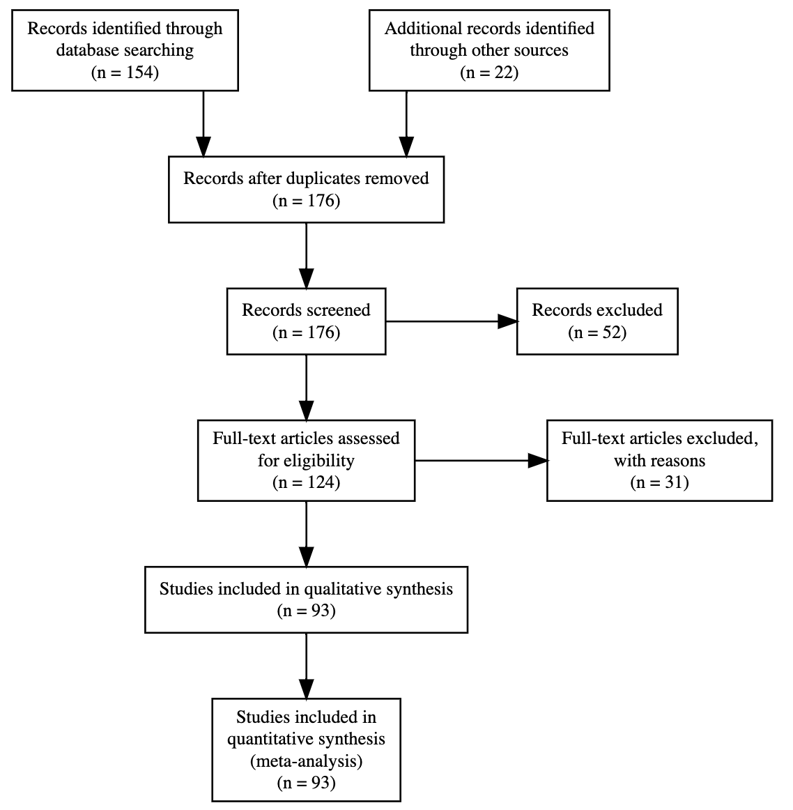

```{r global_options, include=FALSE}
knitr::opts_chunk$set(fig.crop = TRUE, 
                      fig.pos = "tb", fig.path='figs/',
                      echo=F, warning=F, cache=FALSE, 
                      message=F, sanitize = T)
```

```{r, libraries}
library(png)
library(grid)
library(xtable)
library(tidyverse)
library(papaja)
library(knitr)
library(PRISMAstatement)
library(metafor)
library(here)
library(broom)
library(kableExtra)
library(dmetar)
library(DiagrammeR)

```

# Introduction

If a prelinguistic child hears the word "spoon" in the presence of a spoon, how could they know whether the word refers to the whole object, its color, just the bowl but not the rest of the spoon, or this specific spoon but not other spoon-like objects? Despite the large number of logically possible hypotheses about the meaning of each individual word, children learn word meanings quickly [@quine1954]. Additionally, children are few-shot learners, and without explicit instruction or feedback, they are able to generalize the meaning of a word to new members of that semantic category that share some properties with the original referent. For example, if a child hears the word "spoon" in the presence of a spoon, they can generalize this word to other spoons, but not to forks or knives. To resolve this puzzle, researchers have proposed a variety of innate constraints, learned biases, and reasoning processes that could potentially help children identify word meanings, and successfully extend them to category members. One well-studied proposal is the idea that children have a *shape bias*: a tendency to generalize nouns by the referent's shape more than other perceptual attributes like color, texture, or size [@landau1988; @subrahmanyam_2006] or conceptual attributes like a functional, thematic, or a taxonomic match [@imai_childrens_1994; @Poulin-Dubois1999; @imai2010; @yoshida2003known]. 

One reason for researchers' long-standing interest in the shape bias relates to its hypothesized role in early word learning. In one study, @smith_object_2002 trained 17-month-old children over 7 weeks by repeatedly playing with and hearing names of unfamiliar objects from categories that were well organized by shape. Children who received the training showed evidence of generalizing new categories by shape compared with children who hadn't received the training, suggesting that practice with shape categories had helped them acquire a broader, more general shape bias. Further, the trained group learned more object names -- as measured by parent reports -- during and after the intervention, suggesting that the shape bias could be an important tool for noun learning for children in this age group [see [@Perry2010_Variability] for further discussion]. Additionally, it has been found to be weaker in children with language impairments, and in children with autism spectrum disorder [@JONES_SMITH_2005; @Jones2003LateTS; @Collisson2015IndividualDI; @perry2019heterogeneity; @potrzeba2015_ASD; @tek2008children; @perry2021vocabulary]. Although the causality direction is not yet clear, but this suggests that the shape bias may be a useful tool for children learning nouns, and that it may be a useful predictor of language development. 

The shape bias is typically demonstrated in different varieties of word extension tasks. In their basic setup, these tasks typically involve giving a novel label to a single exemplar object, which is then contrasted with test objects that vary in shape, color, texture, or other properties. For instance, in one study 15-month-old children were shown an exemplar object that had a specific non-visual property like producing a sound when tapped. Then children were asked which of the test objects – which matched the exemplar in either color, shape, or material – belonged to the same category. Children selectively extended the non-visual property to the test objects that resembled the exemplar in shape, revealing a bias towards this dimension [@graham_2010; @specific_bloom; @samuelson_dynamic_2007]. 

Yet the degree of shape bias observed in word learning experiments varies across ages, cultures, languages, experimental protocols, and items. Some of this variation has been claimed to be theoretically important -- for example, cross-cultural and developmental variation -- while some is likely due to procedural details, or random statistical variation. In addition, some variation may be caused by publication bias, which has been an issue in other developmental literatures [@bergmann2018;@frank2017]. The current paper aims to synthesize evidence relating to the shape bias, using statistical meta-analysis to quantify its overall effect across different studies, different sources of variation in its magnitude, and to consider links between these sources of variation and potential theoretical accounts.

Here we use the term "bias" as a convenient descriptor of this behavioral phenomenon without presupposing any particular underlying mechanism. Although the underlying mechanism of the phenomenon, i.e. whether it is an automatic attentional mechanism, or a more conceptually regulated process "shape as a cue" is also debated, we do not attempt to resolve this debate in the current paper. Additionally, there seems to be a lack of explicitly shared definition of what characterizes a "shape", whether it involves the skeleton, topology, axes, parts, or the boundaries of an object (More discussion on these variations below). We also don't attempt to provide a specific definition here. Rather we ask how much evidence do we have on the robustness of the behavior, how it varies across different populations and experimental conditions, and do we have moderation power to test for theoretical accounts of the shape bias at the phenomenon level. 

## Theoretical accounts of the shape bias

Where does the shape bias come from? We consider four different explanations of this behavioral tendency: innateness, learning from lexical statistics, learning from syntax, and learning from environmental statistics. These explanations are not necessarily mutually exclusive -- multiple sources could contribute to the developmental emergence of the shape bias. 

One explanation for the shape bias could be that children have an innate tendency to generalize by shape. This proposal was called into question, however, by the observation that the shape bias is primarily found in linguistic generalization tasks as opposed to non-linguistic similarity judgment tasks, indicating that it is unlikely to be a generalized attentional bias [@landau1988; @smith_object_2002; @poulin1999role; @smith1992Adjective; @samuelson2000children; @imai_childrens_1994; @dumb_mechanism1996] [see @specific_bloom for counter argument]. Further, the magnitude of the shape bias appears to vary across ages, language onset, cultures, and languages, inconsistent with a purely nativist explanation.

An alternative proposal argues that children acquire the shape bias by generalizing the lexical statistics of their language. The early vocabulary of English-speaking children in the US is predominantly comprised of nouns referring to solid objects, suggesting that the shape bias may be an "over-hypothesis" that nouns tend to generalize in the same way as one another [@gershkoff2004shape; @samuelson_statistical_2002; @samuelson1999; @perry2010learn; @colunga2000learning; @yoshida2003known; @perry2011; @dumb_mechanism2004; @perry2021vocabulary]. Children's early experience with nouns referring to solid and countable objects, in turn, privileges the property of shape, leading to an inductive bias, such that as children learn more nouns, they should be more likely to pick up on shape as an organizing regularity of the lexicon. This proposal is supported by the observation that both children and computer simulations trained with larger US English vocabulary show a stronger shape bias [@samuelson_statistical_2002; @samuelson1999; @perry2011shape] [see [@spanish_CANTRELL_2012; @colunga2017not; @tek2008children; @perry2021vocabulary; @graham1999infants; @booth2005conceptual; @animate_graham1999] for further discussion and counter arguments]. However, this proposal alone, lacks a quantifiable robust evidence for why children learning different languages (e.g., East Asian languages) show a weaker shape bias, and how their capacity to learn nouns develop. 

Additionally, this generalization may be guided by the syntax of children's native language. In English, count nouns (e.g., "ball") are generalized by shape while mass nouns (e.g., "sand") that cannot be modified by numerals or combined with indefinite articles ("a" or "an") are not. The presence of this distinction might facilitate English-speaking children (and other children learning languages with a mass-count distinction) in picking out the category of words to which the shape bias can be productively applied. In contrast, children learning languages that lack the mass-count distinction (e.g., some East Asian languages like Mandarin or Japanese) do not have access to this organizing principle. Some experiments have explicitly varied whether count/mass language is used in the presentation of new objects, directly testing whether this syntactic cue guides generalization [@samuelson2008rigid; @soja1991ontological; @soja_perception_1992; @tran2012honoring]. Theoretically, this syntactic facilitation could take three routes; it might build the structure of thought that underlies perceiving and categorizing objects from scratch. Secondly, it might provide cues that lead to carving out the existing objects space and restructuring it. Thirdly, it might provide cues that develop sensitives that respect the statistical regularities of both the linguistic and perceptual space without modifying it, making the statistics of the lexicon less clear cut for classifier language speakers. Here, we don't attempt to disentangle these three routes, but rather to quantify the degree to which the shape bias is moderated by the presence of mass/count syntax in the language used in the experiment. 

A final proposal is that shape bias might in part be a function of exposure to manufactured artifacts, since children often see many examples of an artifact that vary in color, size, or texture but are similar in shape (e.g., balls or toy cars). Exposure to such artifacts is higher in industrialized cultures where a built environment is more prevalent. While nearly all hammers are hammer-shaped, many plants are similar to one another in overall shape but vary in other details such as color, texture, or sub-part shape. Children in more industrialized cultures might see relatively more hammer-like categories and relatively fewer plant-like categories compared with children in less-industrialized contexts. Supporting this hypothesis, Tsimane' speakers in Bolivia, who have relatively less artifact experience, showed a lower level of shape bias compared with English speakers from an industrialized culture [@jara2022]. Once again, how much similarity or distinction exists between the statistical regularities in the lexicon and the statistical regularities in the environment is not clear. 

This work aims to quantify how much empirical support there is for each of these theories, and how much of the variation in the shape bias can be explained by the constructs relevant to each theoretical account. 

## Dimensions of variation in the shape bias

Across the large literature that investigates children's shape-based generalizations, the magnitude of the observed shape bias varies widely. We next review some of these sources of variation, which guide the research questions that we assess using our meta-analysis. Some -- but not all -- sources of variation relate to the theoretical proposals about the origins of the shape bias. These links between observed variation and theory are not always clear and have rarely been stated in quantitative form. In the Discussion, we revisit the question of how to link our meta-analysis to the theoretical accounts described above.

First, the shape bias varies developmentally, However, the trajectory of the change is not robustly mapped. For example, it appears to increase at or before the second birthday, continues to increase at the 3rd year until adulthood in some studies [@samuelson2008rigid; @landau1988; @jara2022] and perhaps decreases in some others. For example, in one study, 3-year-olds showed a strong bias to generalize nouns by shape, while 5-year-olds and adults showed a weaker bias [@landau1998object; @subrahmanyam_2006;@imai_childrens_1994]. Age differences were also a function of the specifics of the task, condition, and items used [@imai1997; @graham1999function; @dumb_mechanism1996; @booth2005conceptual;@Subrahmanyam1999_age_complex]. In our meta-analysis, we attempt to quantify developmental change in the magnitude of the bias (Research Question 1).

Second, studies on the shape bias have been conducted across a variety of languages and cultures that vary in their mass/count syntax, other linguistic properties, and many cultural dimensions including environment and industrialization. Speakers of Eastern Asian languages such as Japanese and Mandarin have been claimed to show a reduced tendency to rely on shape for word extension [@gathercole_1997; @imai1997; @jara2022; @samuelson1999; @soja1991ontological; @subrahmanyam_2006; @yoshida2003; @imai2010; @tran2012honoring; @CANTRELL2013258]. The intersection of cross-linguistic and developmental variation adds another layer of complexity. In one study, English- and Mandarin-speaking 3-year-olds generalized by shape. In contrast, Mandarin-speaking 4-year-olds and adults generalized by material while English-speaking 4-year-olds and adults showed a preference for shape [@subrahmanyam_2006]. As is common in cross cultural/cross-linguistic research, observed variation across populations can be difficult to interpret due to the myriad correlated cultural and linguistic factors that differ between populations. We attempt to quantify evidence of cross-cultural differences across ages (Research Question 2).

Third, studies vary significantly in their procedures, stimuli, and comparison dimensions. Whether the stimuli is a real object, an animate, an artifact, a drawing, a silhouette, or a picture. For example, two-year-olds were found to generalize by shape in the case of artifacts, while relying on both shape and texture in the case of animate objects [@booth2005conceptual; @yoshida2003] (see @animate_graham1999 for counter argument). On the other hand, when given information about objects' function, preschool children reportedly used shape to generalize the noun label, while older children were more likely to use function [@graham1999; @gentner_1978; @smith_naming_1996; @landau1998object]. Likewise, shape bias was found to be more prevalent with three dimensional objects than two dimensional ones [@davidson2018effects], and dissipated altogether when children were no longer forced to choose between test objects [@cimpian2005absence].

The shape bias is thought to be a distinctive extension strategy for solid objects, but it is also reported to be mediated by the perceptual boundary between complex and simple objects. For example, English and Japanese-speaking children are found to prioritize shape for complex industrial artifacts with clear functions. Only Japanese children, however, were claimed to show reduced shape generalization for simple uniform objects with no clear function [@imai1997; @gentner_1978; @srinivasan2019_polysemy; @Sandhofer2004_complex; @cook2006_bilingual_complex]. While in other studies the complexity of objects elicited a lower effect, and perhaps was unrelated [@cimpian2005absence; @potrzeba2015_ASD]. Two main points must be noted here, the first is that the notion of object complexity doesn't have a clear and explicitly shared definition. The second is that functionality and complexity are used interchangeably in the literature. For example, in one study, the authors used the term "complex" to refer to industrial objects with a clear function, while in other studies, the same term was used to refer to objects' number of parts, corners, boundaries, curvature, and richness of details, regardless of its industrial and functional status [@imai1997; @gentner_1978; @SON2008_complex; @Subrahmanyam1999_age_complex]. Thus, we also attempt to evaluate the relationship between complexity of objects and the propensity to generalize by shape (Research Question 3).

Finally, the syntax used in the presentation of stimuli varies across experiments. Some experimental procedures explicitly use mass/count marking to manipulate generalization, while other procedures avoid syntactic marking [@soja1991ontological; @imai1997; @samuelson2008rigid; @soja_perception_1992; @perry2011shape; @horst2013s; @dansereau2017young]. Again, sensitivity to mass/count syntax might vary developmentally; in some studies, younger children showed more sensitivity to syntax that is incongruent with the target [e.g., using count syntax with substances; @soja_1992]. We attempt to quantify the effects of syntax and its interaction with development (Research Question 4). 

## The current study

Given the wide range of factors claimed to influence the shape bias, as well as the disparities between studies in their samples and methods, we were interested in consolidating the current base of knowledge. Previous attempts to theoretically and systematically review this phenomenon have been instrumental in understanding the current state of evidence [@KUCKER2019156]. However, it has been limited to qualitative reviews without quantitatively assessing the magnitude of the shape bias across studies.
We therefore use statistical meta-analysis to estimate the overall effect size of the shape bias. In addition, we address the four research questions above by coding variation in age, language/culture, stimuli/procedure, and syntactic framing. We then conduct a series of meta-regressions, testing whether these covariates moderate the estimated shape bias effect. Those moderators are not mutually exclusive, and we do not attempt to disentangle them. Instead, we aim to quantify the degree of variation in the shape bias that can be explained by each of these moderators. With the caveat that we may not have enough data to fully test all of these moderators, which would in itself be a useful finding that speaks to how much empirical support there is for each of the theoretical accounts. 
We also assess the degree of publication bias in the literature, and whether this bias is related to the reported magnitude of the shape bias in published data.
We made the following pre-registered predictions, corresponding to our four research questions:
1. Shape bias increases with age, such that a greater shape bias is observed in older children following (@landau1988).
2. There is a consistent association between culture (with language as a proxy) and shape bias, such that the largest shape bias will be observed in English speaking populations, and the smallest in populations with the least industrialized environments. East Asian countries will lie in the middle (following @imai1997 and @jara2022).
3. The strongest shape bias effect will be observed with simple uniform solid objects (@imai1997). 
4. Lastly, count and mass syntax will moderate the magnitude of the shape bias for younger children but not older children (@soja_1992).

# Methods
```{r include=FALSE}
df_shape <- read_csv(here("data","shape_bias_meta.csv")) |>
  filter(!is.na(d))

df_shape$extraction[df_shape$extraction == "t_test"] <- "t-test"
df_shape$extraction[df_shape$extraction == "paper"] <- "table"
df_shape$englishgrp <- fct_relevel(as.factor(df_shape$language %in% 
                                                 c("english")), 
                                     "TRUE")


df_shape$mean_age_months_centered36 <- df_shape$mean_age_months - 36
df_shape$log_mean_age_months <- log(df_shape$mean_age_months)

# df_shape$indoeuropean <- fct_relevel(as.factor(df_shape$language %in% 
#                                                  c("english","spanish", "german")), 
#                                      "IndoEuropean", "Non-Indoeuropean")

df_shape <- df_shape %>% mutate(indoeuropean = case_when(df_shape$language %in% 
                                                 c("english","spanish", "german") ~ "Indo-European", TRUE ~ "Non-Indo-European"))

df_shape <- df_shape |>
  filter(!is.na(d), !is.na(indoeuropean), !is.na(mean_age_months_centered36))

df_shape <- df_shape %>% mutate(index = 1:length(d))
```

Except where noted, all hypotheses, literature search criteria, and statistical analyses were pre-registered at [http://tinyurl.com/shapebias](). 

## Literature search

```{r include= FALSE, eval=FALSE}
prisma(found = 156,
       found_other = 22,
       no_dupes = 170, 
       screened = 170 , 
       screen_exclusions = 51, 
       full_text = 119,
       full_text_exclusions = 48,  # 39 + 9 papers not coded 
       qualitative = 71,
       quantitative = 71)

```
We created an initial set of papers to screen for inclusion in the meta-analysis. We based this set on the combined output of google scholar searches using the key words "shape bias", "word generalization", "word learning" combined. We also performed forward citation searches of two foundational papers in this literature: @landau1988 and @imai1997, In addition to previously identified studies through domain knowledge and reference lists. Figure \ref{fig:prisma} shows a PRISMA diagram describing our screening process. We only included published papers, excluding unpublished theses and dissertations.
```{r prisma, fig.height = 3, fig.width =4, echo=FALSE, fig.cap="PRISMA diagram showing the results of our literature screening process.", fig.align = "center", fig.pos = "H"}

```
In total, 170 papers were found. We filtered these first via titles and abstracts and then via full-text screening, based on the following eligibility criteria:
1. Effects must be from an experiment (e.g., with random assignment of participants to at least two conditions), 
2. The experiment must include participants less than 5 years old,
3. The experiment must use a word extension task that contrasts shape with other properties of the referent. 

Applying these criteria resulted in `r length(unique(df_shape$ID))` papers that both satisfied our criteria and reported enough information to calculate an effect size (ES) relating to one or more experimental conditions. An ES could be directly reported or could be computed based on reporting of the proportion of choosing shape in text, tables, graphs; or reporting a statistical test (typically a comparison of shape bias against chance using a test such as a one sample $t$-test). 

```{r main_model, include=FALSE}
mod <- rma.mv(yi = d, 
              V = d_var, 
              random = ~ 1 | ID/exp_num/index,
              slab = short_cite, 
              data = filter(df_shape, !is.na(exp_num)))

mod_2lvl <- rma.mv(yi = d, 
              V = d_var, 
              random = ~ 1 | ID/exp_num,
              slab = short_cite, 
              data = filter(df_shape, !is.na(exp_num)))

mod_2lvl <- rma.mv(yi = d, 
              V = d_var, 
              random = ~ 1 | exp_num/index,
              slab = short_cite, 
              data = filter(df_shape, !is.na(exp_num)))

df_forest <- tibble(short_cite = "Meta-analytic estimate", 
                    d = coef(mod), 
                    ci.lb = mod$ci.lb,
                    ci.ub = mod$ci.ub)

#anova(mod, mod_2lvl)

```

```{r heterogeneity, include=FALSE}
#caluculating the heterogeneity from this website: https://www.metafor-project.org/doku.php/tips:i2_multilevel_multivariate 

W <- diag(1/mod$vi)
X <- model.matrix(mod)
P <- W - W %*% X %*% solve(t(X) %*% W %*% X) %*% t(X) %*% W
I2 <- sum(mod$sigma2) / (sum(mod$sigma2) + (mod$k-mod$p)/sum(diag(P)))

# W <- diag(1/mod_2lvl$vi)
# X <- model.matrix(mod_2lvl)
# P <- W - W %*% X %*% solve(t(X) %*% W %*% X) %*% t(X) %*% W
# I2 <- sum(mod_2lvl$sigma2) / (sum(mod_2lvl$sigma2) + (mod_2lvl$k-mod_2lvl$p)/sum(diag(P)))


# using dmetar package for calculating I2 is only for three level modeling, mine is four level
```

```{r include=FALSE}
n_bilingual <- sum(df_shape$monolingual == "bilingual", na.rm=TRUE)
n_atypical <- sum(df_shape$child_type1 == "ASD", na.rm=TRUE)

df_shape <- filter(df_shape, 
                   monolingual == "monolingual", 
                   child_type1 == "TD", 
                   d<5)
```

```{r include=FALSE}
df_shape_solid <- df_shape %>% 
  filter(solid != "substance")
df_shape_summary <- df_shape %>%
  group_by(language) %>%
  summarize(count = n())

df_shape %>% group_by(complexity, ID) %>% filter( complexity == "complex") %>% summarize ( counts = n())
#length(which(df$column_name==value))

```


``` {r age_trend, include=FALSE}
df_shape_solid <- filter(df_shape, !is.na(exp_num), 
                         solidity == "solid")

df_shape_solid <- df_shape_solid %>% mutate(index = 1:length(d))


mod_intercept <- rma.mv(d ~ 1, 
                        V = d_var,
                        random = ~ 1 | ID/exp_num/index, 
                        slab = short_cite, 
                        data = df_shape_solid) 


mod_age <- rma.mv(d ~ mean_age_months_centered36, 
                  V = d_var,
                  random = ~ 1 | ID/exp_num/index, 
                  slab = short_cite, 
                  data = df_shape_solid)

mod_log_age <- rma.mv(d ~ log_mean_age_months, 
                      V = d_var,
                      random = ~ 1 | ID/exp_num/index, 
                      slab = short_cite, 
                      data = df_shape_solid) 

mod_poly <- rma.mv(d ~ I(mean_age_months_centered36^2), 
                   V = d_var,
                   random = ~ 1 | ID/exp_num/index, 
                   slab = short_cite, 
                   data = df_shape_solid)

polycoeff <- tibble(coeff = c(round(coef(mod_age),3)))

AICs <- tibble(aic = c(summary(mod_intercept)$fit.stats[5,'REML'],
                       summary(mod_age)$fit.stats[5,'REML'], 
                       summary(mod_log_age)$fit.stats[5,'REML'],
                       summary(mod_poly)$fit.stats[5,'REML']), 
               model = c("intercept", "age", "logage", "polyage")) |>
  mutate(delta_aic = aic - max(aic))

W_solid <- diag(1/mod_intercept $vi)
X_solid <- model.matrix(mod_intercept )
P_solid <- W_solid - W_solid %*% X_solid %*% solve(t(X_solid) %*% W_solid %*% X_solid) %*% t(X_solid) %*% W_solid
I2_solid <- sum(mod_intercept $sigma2) / (sum(mod_intercept $sigma2) + (mod_intercept $k-mod_intercept $p)/sum(diag(P_solid)))

W_poly <- diag(1/mod_poly $vi)
X_poly <- model.matrix(mod_poly )
P_poly <- W_poly - W_poly %*% X_poly %*% solve(t(X_poly) %*% W_poly %*% X_poly) %*% t(X_poly) %*% W_poly
I2_poly <- sum(mod_poly $sigma2) / (sum(mod_poly $sigma2) + (mod_poly $k-mod_poly $p)/sum(diag(P_poly)))

```

```{r forest, fig.height = 5, fig.width= 3 , echo=FALSE, fig.cap="Forest plot of all coded effect sizes, sorted by average effect size. Multiple points for an individual paper indicate multiple effects. Solid line is zero effect size, dashed line is the overall meta-analytic effect size. Color indicates language family.", fig.pos = "H", fig.align='center'}

#, out.width="100%"

df_shape %>% 
  mutate(short_cite = fct_reorder(short_cite, desc(d))) %>%
  ggplot(aes(x = short_cite, y = d, 
             ymin=d-sqrt(d_var)*1.96,
             ymax=d+sqrt(d_var)*1.96)) + 
  geom_pointrange(aes(color=indoeuropean), alpha = .5, position=position_dodge2(width=.5), size = 0.1) +
  geom_pointrange(data = df_forest, 
                  aes(ymin = ci.lb - 0.3, ymax = ci.ub + 0.3), pch = 5, col = "black", size = 0.2) + 
  coord_flip() +
  geom_hline(yintercept = 0, size = 0.2) +
  geom_hline(data = df_forest ,yintercept = df_forest$d , lty = 2 ) +
  aes(x=reorder(short_cite,-d, sum)) +  
  ylab("Standardized Mean Difference (d)") + 
  xlab("Citation") +
  ggthemes::scale_color_solarized(name = "Indo-European") +
  theme_minimal(base_size = 6) +
  # theme(legend.position = c(0.8, 0.5), legend.title=element_blank(), axis.title.y =element_blank(), 
  #       legend.background = element_rect(color = NA)) + 
  theme(legend.position = "bottom", legend.title=element_blank()) +
  guides(color = guide_legend(override.aes = list(size = 0.1))) 

#c(0.1, 0.25)
```

## Coding of effect size and moderators

The shape bias is typically assessed through word extension tasks [@landau1988]. In this task, children are shown a novel object labeled with a novel noun such as a "dax", presented with test objects varying in shape, and asked if each is a "dax." Most studies use either forced choice or endorsement tasks where children judge objects based on category membership.

We coded the effect size for each experimental condition as the standardized mean difference (Cohen's $d$) between the proportion of children who extended the label to shape-matching objects compared with other properties (e.g., color, texture, or material). In the case of forced-choice tasks, the effect size was calculated against chance, depending on the number of choices. In the case of endorsement tasks, the effect size was calculated as the difference between the proportion of children who extended the label to shape-matching objects compared with other properties (e.g., color, texture, or material).

We coded the variance of each effect size using the formula for Cohen's $d$ [@higgins2003].
Because many of the papers we coded were decades old, reporting standards varied considerably. Additionally, because studies often included multiple age groups, different types of stimuli, and various manipulations, one experiment usually yielded more than one effect size, and often papers included multiple experiments. Estimation of effect sizes followed this order of precedence: If the paper reported Cohen's d, we used it directly (N=`r sum(df_shape$extraction == "reported")`). If the Cohen's d was not reported, we looked for test statistics (N=`r sum(df_shape$extraction == "t-test")`). In the absence of this information, we used proportions reported in text and tables (N=`r sum(df_shape$extraction == "table")`), or graphs (N=`r sum(df_shape$extraction == "graph")`) along with the standard deviation SD or the standard error SE. In the absence of reported SD or SE, we computed these via standard formulae.

For each effect size, we attempted to code the following moderators: participant age; number of participants; type of syntax used -- informative (count/mass) or neutral^[We additionally coded whether common or proper noun syntax was used and (if applicable) whether animate or inanimate syntax was used, but both of these were sparsely used and we do not discuss them further.]; alternative test objects properties (e.g., shape, color, material); nature of the stimuli: solidity, animacy, and whether they were two- or three-dimensional; type of exposure before testing (whether the child saw multiple training examples of the target object, or just a single example); child's vocabulary size; country of test and language spoken by participants; response mode (grasping, pointing, or verbalizing); measured behavior (e.g., behavioral, eye tracking); population type (typically developing or not); total number of trials. (Effect sizes are estimated across different groups of contrasting properties: shape vs color, material, function etc.).

For our preregistered analyses, we excluded effect sizes from clinical populations (N=`r n_atypical`) and multilingual populations (N=`r n_bilingual`), because they are known to be very heterogeneous, though these effect sizes remain in the data file we provide.
Representation across languages varied substantially, such that there were `r sum(df_shape$language == "english")` effect sizes for English while other languages included only `r sum(df_shape$language != "english")` data points. Other languages included German(`r sum(df_shape$language == "german")`), Spanish(`r sum(df_shape$language == "spanish")`), Chinese(`r sum(df_shape$language == "mandarin")`), Japanese(`r sum(df_shape$language == "japanese")`), Korean(`r sum(df_shape$language == "korean")`), Vietnamese(`r sum(df_shape$language == "vietnamese")`), and Tsimane(`r sum(df_shape$language == "tsimane")`). 
The final coded sample consisted of `r length(unique(df_shape$ID))` papers with `r nrow(df_shape)` effect sizes. 

## Analytic approach

All analyses were performed using the `metafor` package in R [@viechtbauer2010]. We pooled effect sizes using a multi-level meta analysis model with effect size nested within experiment number, in turn nested within paper ID as a random effect. This complex random effect structure was necessary due to the non-independence of effect sizes from the same experiment and/or paper, since these experiments would typically share many characteristics (e.g., measure, procedure, or stimuli). We attempted to perform confirmatory analysis of our preregistered hypotheses via multi-level meta-regressions including age, language, item properties of the stimuli, and syntax as fixed effects. In some cases (described below), we did not have sufficient data to add particular factors to our analyses.

# Results

Figure \ref{fig:forest} shows the forest plot for coded effect sizes. Our initial meta-analytic model with no moderators revealed an overall effect size of `r round(coef(mod), 2)` [`r round(mod$ci.lb, 2)`, `r round(mod$ci.ub,2)`] ($p$ `r papaja::apa_p(mod$pval)`). Nevertheless, effects varied substantially, yielding a substantial amount of within- and between-study heterogeneity ($I^2 = `r round(I2, 2)`$). 

Not all stimuli in our coded studies were expected to produce a shape bias, with `r length(which(df_shape$solidity == 'solid')) ` effect sizes involving solid objects and only `r length(which(df_shape$solidity != 'solid'))` using non-solid objects. Although we did not preregister removing studies with non-solid targets, we believe this is an important step since all theories of the shape bias would predict smaller effects for non-solid targets. In our remaining analysis, we focus on the subset of effects using solid objects, deviating from our preregistration. Heterogeneity for this subset is ($I^2 = `r round(I2_solid, 2)`$). So, the heterogeneity remains high even when generalizing by shape for a set of stimuli with only solid objects, motivating the moderation analyses below. 

## Developmental change
```{r include=FALSE}

mod_ployage_ie <- rma.mv(d ~ mean_age_months_centered36 * indoeuropean + I(mean_age_months_centered36^2) * indoeuropean, 
                         V = d_var,
                         random = ~ 1 | ID/exp_num/index, 
                         slab = short_cite, 
                         data = df_shape_solid)

#anova(mod_poly , mod_ployage_ie, refit=TRUE)

poly_predictions <- as.data.frame (predict(mod_ployage_ie))
poly_predictions$short_cite <- df_shape_solid$short_cite
vector1 <- 1:nrow(df_shape_solid)
poly_predictions$index <- vector1
# df_shape_solid$index <- vector1
merged <- merge(x = poly_predictions, 
                y = df_shape_solid[ , c("mean_age_months", "indoeuropean",
                                        "index")], by = "index")


W_age_lang <- diag(1/mod_ployage_ie $vi)
X_age_lang <- model.matrix(mod_ployage_ie )
P_age_lang <- W_age_lang - W_age_lang %*% X_age_lang %*% solve(t(X_age_lang) %*% W_age_lang %*% X_age_lang) %*% t(X_age_lang) %*% W_age_lang
I2_age_lang <- sum(mod_ployage_ie $sigma2) / (sum(mod_ployage_ie $sigma2) + (mod_ployage_ie $k-mod_ployage_ie $p)/sum(diag(P_age_lang)))

```


```{r dev-change, fig.width = 8, fig.height= 4, out.width = "100%", fig.cap = "Effect size plotted by average participant age. Points indicate individual effect, and error bars show variance. Points are colored based on language, and model fits for Indo-European and non-Indo-European languages are shown in black.", fig.pos = "H"}
ggplot(df_shape_solid,
       aes(x = mean_age_months, y = d, color = language)) +
  geom_pointrange(aes(ymin = d - d_var, ymax = d + d_var),
                  alpha = .5, size = 0.1) +
  geom_line(data = merged, 
            aes(y = pred),
            group = 1, 
            col = "black") +
  geom_hline(yintercept = 0, lty = 3) + 
  ylab("Standardized Mean Difference (d)") + 
  xlab("Mean age (months)") +
  scale_color_discrete(name = "Language") +
  facet_wrap(~indoeuropean) + 
  theme_minimal() + 
  theme(legend.position = "bottom")
```

Due to the high overall heterogeneity, we investigated the influence of the developmental changes in the magnitude of the shape bias by adding age as a factor. Model selection followed our preregistered strategy of comparing four types of functional forms in our multi-level model: constant, linear, logarithmic, and quadratic, using the corrected Akaike information criterion AICc. A difference of $\Delta_{AIC} > 4$ between the lowest AICc and any other AICc was interpreted as a meaningful difference. 

All models including age fit better than the model without age ($\Delta_{AIC}$ between `r round(AICs$delta_aic[AICs$model == "logage"], 2)` and `r round(AICs$delta_aic[AICs$model == "polyage"], 2)`). Although with ($\Delta_{AIC}$ that is smaller than our pre-specified meaningful difference of 4, the polynomial model fit best ($\Delta_{AIC} =$ `r round(AICs$delta_aic[AICs$model == "polyage"] - AICs$delta_aic[AICs$model == "age"], 2)`). So we adopted a polynomial function for our subsequent analysis with a significant overall estimate of `r round(polycoeff$coeff[1], 3)` ($p=$ `r papaja::apa_p(mod_poly$pval)[1]`), an age coefficient of `r round(polycoeff$coeff[2], 5)` ($p=$ `r papaja::apa_p(mod_poly$pval)[2]`) and a heterogeneity of ($I^2 = `r round(I2_poly, 2)`$).

``` {r eggers test copied from its source code, eval = FALSE}
eggers.test = function(x) {

    # Validate
    x = x

    if (x$k < 10) {

        warning(paste("Your meta-analysis contains k =",
                      x$k, "studies. Egger's test may lack the statistical power to detect bias when the number of studies is small (i.e., k<10)."))

    }

    if (class(x)[1] %in% c("meta", "metabin", "metagen", "metacont", "metacor", "metainc", "metaprop")) {

        # Conduct metabias
        eggers = meta::metabias(x, k.min = 3, method = "linreg")

        # Get Intercept
        intercept = as.numeric(eggers$estimate[1])

        # Get SE
        se = as.numeric(eggers$estimate[2])

        # Calculate 95CI
        llci = intercept - qnorm(0.975) * se
        ulci = intercept + qnorm(0.975) * se

        # Get t
        t = as.numeric(eggers$statistic)

        # Get df
        df = as.numeric(eggers$parameters)

        # Get p
        p = as.numeric(eggers$p.value)

        # Make df
        returnlist = list(intercept = intercept,
                          llci = llci,
                          ulci = ulci,
                          t = t,
                          p = p,
                          meta.obj = x)

    } else {

        stop("x must be of type 'metabin', 'metagen', 'metacont', 'metainc' or 'metaprop'")

    }

    class(returnlist) = "eggers.test"

    return(returnlist)

}
```

``` {r include = FALSE}

eggerstest <- df_shape_solid %>%
  mutate(y = d/d_var, x = 1/d_var) %>%
  lm(y ~ x, data= .) %>%
  summary()

eggerscoeff <- tibble(coeff = c(round(coef(eggerstest),2)))
```

## Cross-linguistic differences

Based on the previous literature, we hypothesized that language and culture would be potential moderators influencing the degree of shape-based generalization. However, due to limited data availability beyond English, conducting language-specific analyses was not feasible. As a consequence, languages were categorized into two groups: Indo-European (encompassing German and Spanish and English), Non-Indo-European (including Japanese, Mandarin, Vietnamese, Korean, and Tsimane). We acknowledge that this grouping is not ideal, as it might oversee some linguistic and cultural diversity, for example, Japanese and Tsimane being in the same group despite the vast cultural and environmental differences. However, it allows us to test our hypothesis regarding the influence of language on shape bias given the data limitation.

```{r include = FALSE, results = 'asis'}

#contrasts(df_shape$indoeuropean) <- contr.sum

lang_model <- rma.mv(d ~ mean_age_months_centered36 * indoeuropean + I(mean_age_months_centered36^2) * indoeuropean, 
                     V = d_var,
                     random = ~ 1 | ID/exp_num/index, 
                     slab = short_cite, 
                     data = df_shape_solid)


lang_model_all <- rma.mv(d ~ mean_age_months_centered36 * language + I(mean_age_months_centered36^2) * language, 
                     V = d_var,
                     random = ~ 1 | ID/exp_num/index, 
                     slab = short_cite, 
                     data = df_shape_solid)

mdlcoeff <- tibble(coeff = c(coef(lang_model)))
#mdlcoeff <- tibble(coeff = c(round(coef(lang_model),2)))
#mdlcoeff$coeff[1]


W_lang <- diag(1/lang_model$vi)
X_lang <- model.matrix(lang_model)
P_lang<- W_lang - W_lang %*% X_lang %*% solve(t(X_lang) %*% W_lang %*% X_lang) %*% t(X_lang) %*% W_lang
I2_lang <- sum(lang_model$sigma2) / (sum(lang_model$sigma2) + (lang_model$k-lang_model$p)/sum(diag(P_lang)))


lang_model_df <- as.data.frame(round(coef(summary(lang_model)), 4))

kableExtra::kbl(lang_model_df) %>%
  kable_classic_2(full_width = F)

writeLines(knitr::kable(lang_model_df,
                        format = "latex", 
                        digits = 3,
                        table.attr = "style='width:10%;'"))

summary(lang_model)

```


\begin{table}[t]
\centering
\resizebox{0.7\textwidth}{!}{%
\begin{tabular}{lrrrrrr}
\hline
  & \bf{$\beta$} & \bf{SE} & \bf{$z$} & \bf{$p$} & \bf{lower CI} & \bf{upper CI}\\
\hline
Intercept & 0.7457 & 0.1184	 & 6.2985 & <.0001 & 0.5136	& 0.9777\\
Age & 0.0125 & 0.0060 & 2.0723 & 0.0382 & 0.0007 & 0.0243\\
Non-Indo-European & -0.1582 & 0.1733 & -0.9127 & 0.3614 & -0.4980 & 0.1815\\
$\text{Age}^2$ & -0.0007 & 0.0003 & -2.3854 & 0.0171 & -0.0012 & -0.0001\\
Age $\times$ Non-IE & -0.0213 & 0.0170 & -1.2532 & 0.2101 & -0.0547 & 0.0120\\
Non-IE $\times \text{Age}^2$ & 0.0005 & 0.0007 & 0.7655 & 0.4440 & -0.0008 & 0.0018\\
\hline
\end{tabular}
}
\caption{\label{langmodel} Results of the meta-regression model incorprating both language and age (in months). Non-IE = "Non-Indo-European."}
\end{table}

A model incorporating language group and age as moderators revealed a significant coefficient of `r round(mdlcoeff$coeff[1], 2)` ($p=$ `r papaja::apa_p(lang_model$pval)[1]`) for Indo-European populations at the age of 36 months, with a smaller predicted effect for the non-Indo-European group `r round(mdlcoeff$coeff[3], 2)` ($p=$ `r papaja::apa_p(lang_model$pval)[3]`). The effect showed a gradual but significant decline with quadratic age `r round(mdlcoeff$coeff[4], 6)` ($p=$ `r papaja::apa_p(lang_model$pval)[4]`) and the between-study heterogeneity remained high in this moderated model ($I^2 = `r round(I2_lang, 2)`$), with most of the variance at the between-paper level ($sigma^2$ = `r round(lang_model$sigma2[1])`). All coefficients are shown in Table \ref{langmodel}, and Figure \ref{fig:dev-change} shows model fit compared with individual effect size estimates. 

``` {r  include = FALSE}
tidy_lang_model <- tidy(lang_model)

# Assuming lang_model is your model object
rownames(tidy_lang_model) <- paste0(c("intercept", "Age", "non-indo-european", "Age * non-ind                                                       o-european"), 1:nrow(tidy(lang_model)))

# Use the corrected lang_model in apa_table
coef(summary(lang_model)) |>
  papaja::apa_table(row.names =  TRUE)

```

```{r include = FALSE}
df_shape_indo <- df_shape_solid %>%
  filter(indoeuropean == TRUE)

df_shape_nonendo <- df_shape_solid %>% 
  filter(indoeuropean == FALSE)

```

## Shape and complexity effects

<!-- * RQ3: The strongest shape bias effect will be observed with simple uniform solid objects.  -->
We also hypothesized that the complexity of solid objects might moderate shape bias. However, only four papers in our sample reported complexity as a dimension of interes and explicitly classified objects across this dimension with (`r length(which(df_shape$complexity == 'complex'))` mentions of complex and `r length(which(df_shape$complexity == 'simple'))` simple objects). Thus, assessing the impact of object complexity was impractical due to sparse data, variations in stimulus types across studies, along with unclear criteria for categorizing objects as complex or simple, posing challenges for a comprehensive analysis. 

## Syntactic effects

<!-- * RQ4: Lastly, count and mass syntax will moderate the magnitude of the shape bias for younger children but not older children.   -->

``` {r include = FALSE}
# polynomial
syntax_model <- rma.mv(d ~ mean_age_months_centered36 * Informative_syntax  + I(mean_age_months_centered36^2) * Informative_syntax, 
       V = d_var, 
       random = ~ 1 | ID/exp_num/index,
       slab = short_cite, 
       data = df_shape_solid)

mdlsyntaxcoeff <- tibble(coeff = c(round(coef(syntax_model),2)))

count_mass_df <- df_shape_solid %>% filter(Informative_syntax != "neutral" & count_mass != "not mentioned" & count_mass != "both")

count_model <- rma.mv(d ~ mean_age_months_centered36 * count_mass  + I(mean_age_months_centered36^2) * count_mass, 
       V = d_var, 
       random = ~ 1 | ID/exp_num/index,
       slab = short_cite, 
       data = count_mass_df)

# library(emmeans)
# 
# # Calculate estimated marginal means
# emm <- emmeans(syntax_model, ~ Informative_syntax)
# 
# # Display the estimated marginal means
# summary(emm)
```


Lastly, we hypothesized that an informative count/mass noun syntax marking would moderate the extent of the shape bias in younger ages. A model that incorporated age and the nature of syntactic marking (informative or neutral) indicated neither a significant effect of syntax on effect size ($p=$ `r papaja::apa_p(syntax_model$pval)[3]`), nor an interaction with age. The majority of studies in our sample used informative syntax, with `r length(which(df_shape_solid$Informative_syntax == "neutral"))` effect sizes using neutral syntax. Yet, a model with only a subset of the data that used informative syntax comparing count to mass syntax instruction did not yield a significant effect of this distinction ($p=$ `r papaja::apa_p(count_model$pval)[3]`). However, interpretation of this result is not straightforward given that even this subset of experiments that compared count and mass syntax still carried over the general imbalance in the data. If this manipulation was predominantly used with English speaking children, and only `r (length(which(df_shape_solid$mean_age_months < 24)) / nrow(df_shape_solid) ) *100`% of our data came from younger than two years old children (with the assumption that this age group could be the least sensitive to syntax), then historical exposure to this syntactic distinction may have influenced the results. 

## Publication bias

One potential source of bias in meta-analysis comes from publication bias, the tendency for positive findings (e.g., effects that are significant at $p < .05$) to be included in papers both submitted and accepted for publication. A significance funnel plot (depicted in Figure \ref{fig:funnelplot}) showed a large group of positive studies with large standard errors, consistent with a publication bias in which noisy studies with positive effect are more likely to appear in the literature  [note that we use an updated funnel plot visualization @mathur2020]. We employed an Egger's regression test as a quantitative measure to assess any asymmetry within the funnel plot. The results yielded a statistically significant positive intercept `r round(eggerscoeff$coeff[1], 2)` ($p< 0.0001$), affirming the presence of this asymmetry, an indictor of publication bias. 

# Discussion
We were interested in taking stock of evidence for the shape bias, as well as quantifying its variation across cultures, ages, and experimental conditions.  Synthesizing effect sizes across studies provided evidence of a shape bias across nearly all ages and languages studied, with a marginally significant evidence for a cross-cultural difference, and huge between-study heterogeneity. The preponderance of large effect sizes from small studies in our data suggests there may be a bias to publish effects favoring the existence of a shape bias, but drawing definitive conclusions about this kind of publication bias is challenging.

Although we are hesitant to over-interpret developmental trends given the heterogeneity we observed, we offer support for one explanation here. The quadratic developmental curve of shape bias is consistent with the notion that shape bias is a statistical over-generalization built on the associations children draw between the type of objects encountered in their early life and how those objects are labeled. Therefore, younger children may not have enough data to form strong associations between noun labels and object properties, while the oldest group might have experienced some sort of a hypothesis shift after gaining more knowledge and experience with noun labels and associated object properties, hence producing this curvi-linear trajectory [@samuelson2008rigid]. 

Statistical generalization theories of shape bias have two proposed (not mutually exclusive) sources of this generalization: lexical statistics and environmental regularities. Lexical statistics studies tend to focus on early English vocabulary, while the primary investigation of environmental regularities compared US and Tsimane groups in Bolivia. Direct examination of these statistical regularities hypotheses in the current meta-analysis was impeded, however, by limited data availability on the lexical statistics, early vocabulary composition, and the distribution of shape-based objects in other communities and languages. The interchangeable nature of language and location variables in our dataset (e.g., English predominantly corresponds to the US, and Japanese to Japan), as well as the potential role of syntax in forming associations, making it challenging to differentiate the influence of these various factors [@gershkoff-stowe_shape_2004;@samuelson1999;@jara2022; @imai1997; @barner_language_2009].

Although developmental change explains some of the variation in the shape bias, the heterogeneity of effect sizes between studies remained high even when controlling for age. This result suggests that task specifics and stimuli may exert a strong influence over the outcome of the studies in ways unintended by the experimenters, underscoring the need to examine the reliability and validity of the measures employed [@cimpian2005absence ; @imai1997; @samuelson_dynamic_2007]. For instance, the data in some studies might be contaminated by the use of familiar stimuli. Some studies use novel objects with novel labels, others use familiar objects with novel labels; both make claims about early label based category induction with different age groups. If familiar objects were used to test relatively older children (4 or 5 years old), these children can utilize their prior knowledge and experience to categorize objects, not solely relying on perceptual properties' saliency.

Empirical efforts to distinguish the shape bias at the phenomenon level from the mechanistic level has involved changing many parameters that are of theoretical interest to the specific hypothesis being tested. An example of this is the investigation of the influence of conceptual information and functionality on word meaning acquisition and the nature of hypothesis shift the child undergoes to relinquish shape bias in favor of other bases. In this subdivision of the literature, functionality has been closely related to complexity [@imai1997;@cimpian2005absence], with both terms used interchangeably and having very fluid, if existent, definitions. The current meta-analysis highlights the need for more nuanced investigation of both dimensions to adjudicate them.
```{r funnelplot, fig.width= 4, fig.height= 3, include=TRUE, fig.cap="The significance funnel plot shows individual effect sizes on the x-axis and corresponding standard error on the y-axis. The diagonal line shows effect sizes that are exactly p = 0.05. Yellow values show affirmative (significant) studies. The diamond shows the estiamte from the meta-analytic model described above.", fig.align = "center", , fig.pos = "H"}

#linear model
PublicationBias::significance_funnel(yi = df_shape_solid$d,
                                     vi = df_shape_solid$d_var,
                                     est_all = coef(mod_age)[1]) +
  theme(legend.position = "bottom")

# df_shape_solid_english <- df_shape_solid %>%
#   filter(language != "english")
# 
# PublicationBias::significance_funnel(yi = df_shape_solid_english $d,
#                                      vi = df_shape_solid_english$d_var,
#                                      est_all = coef(mod_age)[1]) +
#   theme(legend.position = "bottom")

# PublicationBias::significance_funnel(yi = df_shape_solid$d,
#                                      vi = df_shape_solid$d_var,
#                                      est_all = coef(mod_age)[1]) +
#   geom_point(aes(shape = factor(df_shape_solid$language)), size = 2) + # Add points with shape mapped to language
#   theme(legend.position = "bottom")

```
Broadness of the theory on what a specific response implies about the underlying knowledge and mechanisms is a double-edged sword. On the one hand, it allows for a wide range of experimental manipulations to be tested, providing a robust evidence of the phenomenon that is replicable across studies. But on the other hand, it makes it difficult to draw clear conclusions about the nature of the shape bias itself and broadly basis of label catgerization and word extension. The current meta-analysis sheds light on the sparsity of the moderation space, as we found that many studies used different types of stimuli, tasks, and measures, making it challenging, even with a meta-analysis, to recognize the potentially relevant factors, and their interactions over different contexts within the same population, let alone across different populations, and arrive at a commensurable and integrative body of evidence about what a word could mean to a young child [@Almaatouq_Griffiths_Suchow_Whiting_Evans_Watts_2024]. In sum, we believe this work highlights the need for a different framework to examine the shape bias and word learning that utilizes reliable and valid measures, as well as unified procedures to facilitate clearer interpretations and theoretical comparisons.

\newpage
# References

::: {#refs custom-style="Bibliography"}
:::
